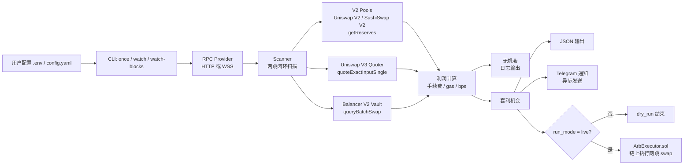
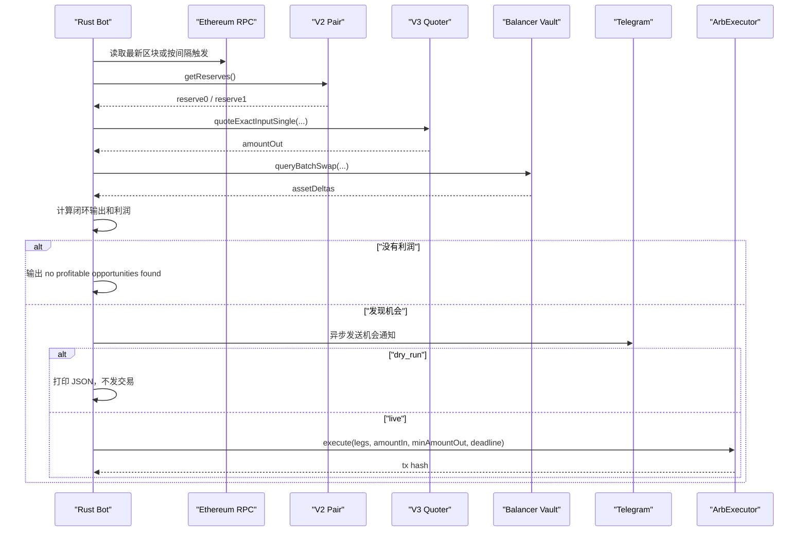
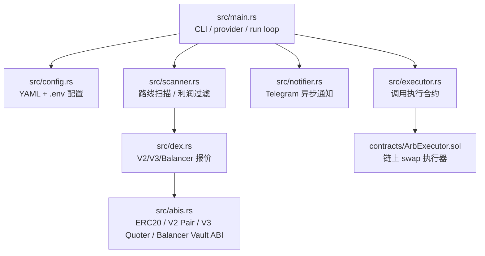
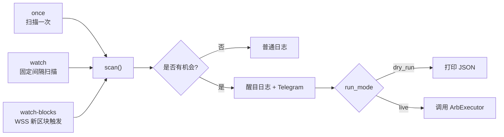
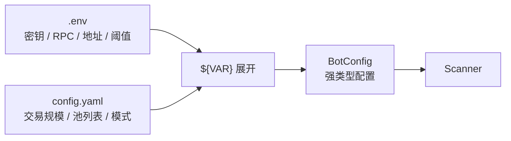
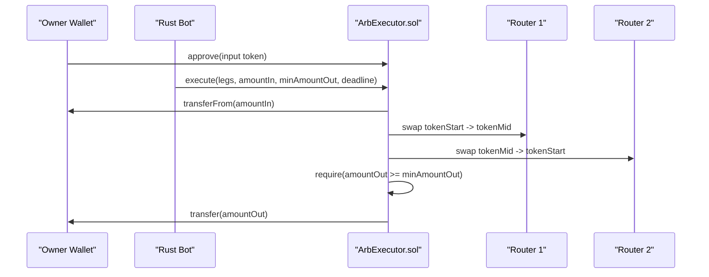

# Uniswap Arbitrage Bot

合规版 Rust DEX 套利机器人。它只基于已确认链上状态和 `eth_call` 报价寻找跨池价差，不监听 mempool，不抢跑用户交易，不构造三明治策略。

当前示例配置支持：

- Uniswap V2
- Uniswap V3
- SushiSwap V2
- Balancer V2
- WETH/LINK、WETH/UNI、WETH/AAVE、WETH/WBTC
- 固定间隔扫描和 WSS 新区块触发扫描
- dry-run 输出、live 执行合约、Telegram 异步通知

## Overall Architecture



## Scan Flow

机器人做的是两跳闭环套利：

```text
WETH -> Token -> WETH
```

同一个交易对可以跨多个池比较，例如：

```text
Uniswap V2 WETH/LINK -> SushiSwap V2 WETH/LINK
SushiSwap V2 WETH/WBTC -> Uniswap V3 WETH/WBTC
Uniswap V3 WETH/UNI -> Uniswap V2 WETH/UNI
Balancer V2 WETH/LINK -> Uniswap V2 WETH/LINK
```



## Module Map



| 模块 | 职责 |
| --- | --- |
| `src/main.rs` | CLI 命令、HTTP/WSS provider、扫描循环 |
| `src/config.rs` | 加载 `.env` 和 `config.yaml`，校验参数 |
| `src/dex.rs` | V2 reserve 报价、V3 Quoter 报价、Balancer Vault 报价 |
| `src/scanner.rs` | 枚举同交易对池子，计算两跳闭环利润 |
| `src/notifier.rs` | 发现机会后异步 Telegram 通知 |
| `src/executor.rs` | live 模式下调用执行合约 |
| `contracts/ArbExecutor.sol` | 执行 V2/V3/Balancer 两跳 swap 并做 `minAmountOut` 保护 |

## Runtime Modes



## Quick Start

```bash
cp .env.example .env
cp config.example.yaml config.yaml
```

编辑 `.env`：

```env
RPC_URL=https://your-mainnet-rpc
WS_RPC_URL=wss://your-mainnet-wss
RUN_MODE=dry_run
MIN_PROFIT_BPS=20
DEBUG_QUOTES=false
```

扫描一次：

```bash
cargo run -- --config config.yaml once
```

固定间隔扫描：

```bash
cargo run -- --config config.yaml watch
```

新区块触发扫描：

```bash
cargo run -- --config config.yaml watch-blocks
```

## Configuration Design



`.env` 放敏感和环境相关参数：

```env
RPC_URL=
WS_RPC_URL=
PRIVATE_KEY=
TELEGRAM_BOT_TOKEN=
TELEGRAM_CHAT_ID=
```

`config.yaml` 放结构化策略参数：

```yaml
run_mode: ${RUN_MODE}
min_profit_bps: ${MIN_PROFIT_BPS}
trade_sizes:
  - token: "${WETH_ADDRESS}"
    amount_wei: "${TRADE_AMOUNT_WEI}"
pools:
  - kind: v2
    name: "sushiswap-v2-weth-wbtc"
    pair: "${SUSHISWAP_V2_WETH_WBTC_PAIR}"

  # Balancer V2 示例；pool_id 必须替换为真实 32 字节 poolId。
  # - kind: balancer_v2
  #   name: "balancer-v2-weth-link"
  #   vault: "0xBA12222222228d8Ba445958a75a0704d566BF2C8"
  #   pool_id: "0xYour32ByteBalancerPoolId"
  #   token0: "0xLinkToken"
  #   token1: "0xWethToken"
```

真实 `.env` 和 `config.yaml` 已被 `.gitignore` 忽略，只提交 `.env.example` 和 `config.example.yaml`。

## Profit Filter

每条候选路线都会计算：

```text
amount_in
amount_after_first
amount_out
gross_profit = amount_out - amount_in
estimated_net_profit = gross_profit - gas_cost
profit_bps = estimated_net_profit / amount_in * 10000
```

只有满足：

```text
amount_out > amount_in
profit_bps >= MIN_PROFIT_BPS
```

才会被认为是套利机会。

如果起始 token 是 `native_wrapped_token`，例如 WETH，会用：

```text
gas_limit * max_gas_price_gwei
```

扣减预估 gas 成本。

## Debug Quotes

调试时打开：

```env
DEBUG_QUOTES=true
RUST_LOG=info
```

运行：

```bash
cargo run -- --config config.yaml once
```

常见过滤原因：

| reason | 含义 |
| --- | --- |
| `not_gross_profitable` | 两跳后本金都没有回来 |
| `below_min_profit_bps` | 有利润，但低于阈值 |
| `quote_error` | Quoter 或 RPC 报价失败 |
| `pool_pair_mismatch` | 两个池不是同一交易对 |
| `first_quote_zero` | 第一跳输出为 0 |

## Balancer V2

Balancer V2 使用统一 Vault 入口。机器人在扫描时对 `queryBatchSwap` 做 `eth_call` 报价；live 模式下，执行合约使用同一个 Vault 的 `batchSwap` 完成单跳 swap。

配置要点：

- `vault` 填 Balancer V2 Vault 地址。
- `pool_id` 填真实 32 字节 poolId，不能填普通 token 地址或 pair 地址。
- `token0` / `token1` 要和这个 Balancer 池实际支持的两个 token 对应。
- 只要交易对相同，Balancer 池可以和 Uniswap V2/V3、SushiSwap V2 做跨平台比较。

## Telegram Alerts

发现机会时，机器人会异步发送 Telegram 消息，不阻塞扫描流程。

开启方式：

```env
TELEGRAM_ENABLED=true
TELEGRAM_BOT_TOKEN=123456:your_bot_token
TELEGRAM_CHAT_ID=123456789
```

测试真实发送：

```bash
cargo test sends_real_telegram_message_when_env_is_configured -- --ignored --nocapture
```

## Live Mode

live 模式路径：



live 模式需要：

1. 部署 `contracts/ArbExecutor.sol`
2. 钱包对执行合约 `approve` 输入 token
3. `.env` 配置 `PRIVATE_KEY`
4. `config.yaml` 设置：

```yaml
run_mode: live
executor:
  address: "${EXECUTOR_ADDRESS}"
  private_key: "${PRIVATE_KEY}"
  deadline_secs: ${DEADLINE_SECS}
```

资金默认保留在钱包里。执行时合约通过 `transferFrom` 临时拉取本金，完成 swap 后把最终资产转回 owner。

## Safety Checklist

- 先在 `dry_run` 跑通报价和日志。
- 实盘前在 fork 环境测试执行合约。
- 从小额 `TRADE_AMOUNT_WEI` 开始。
- 使用独立钱包和有限授权。
- 设置保守的 `MIN_PROFIT_BPS`。
- 确认 Telegram、RPC、WSS 配置没有提交到仓库。
- 本项目不监听 pending transaction，不做三明治策略。

## Development

```bash
cargo fmt
cargo test
cargo check
```

默认测试不会真实发送 Telegram。真实发送测试是 `#[ignore]`，需要显式运行。
